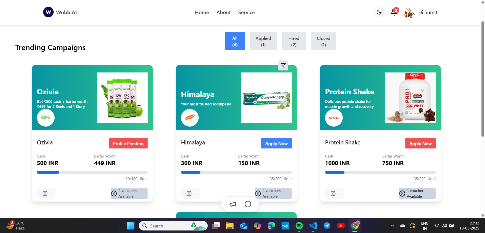
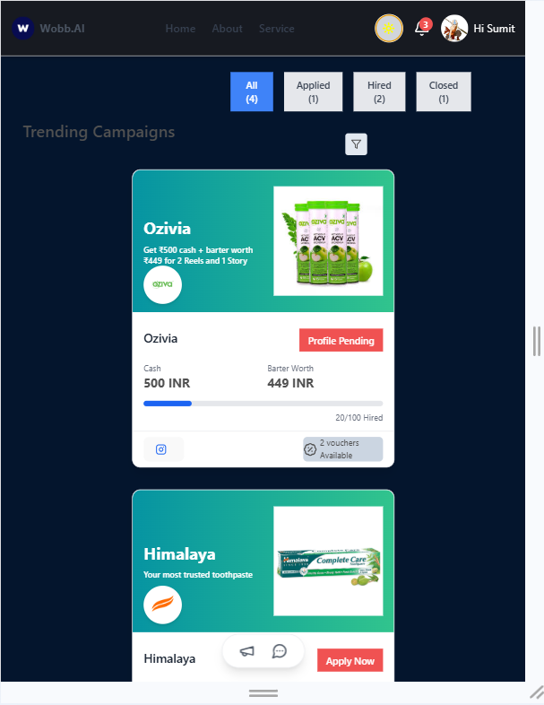
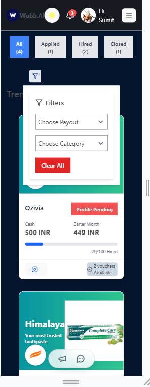

# **Wobb-Campaign Listing App**  

A simple React-based frontend that displays a list of campaign offers, allowing users to filter and sort them based on different criteria.

---

## **🛠 Tech Stack**  
- **Frontend**: React, Vite, Tailwind CSS  
- **State Management**: useState, useEffect, Context API  
- **Icons**: Lucide React  

---

## **📌 Features**  
✅ Dynamic campaign listing with sorting and filtering  
✅ Category-based sorting (Applied, Hired, All)  
✅ Filter options (Payout type, Campaign category)  
✅ Responsive design using Tailwind CSS  
✅ Smooth UI with loading skeleton placeholders  

---

## **🚀 Getting Started**  

### **1️⃣ Clone the Repository**  
```sh
git clone https://github.com/Sumit0071/Wobb-assignment.git
cd Wobb-assignment
```

### **2️⃣ Install Dependencies**  
```sh
npm install
```

### **3️⃣ Start the Development Server**  
```sh
npm run dev
```
The app will be available at **`http://localhost:5173`**.  

---

## **📸 Screenshots**  

### **Laptop View**  
  

### **Tablet View**  
  

### **Mobile View**  
  

---

## **📹 Demo Video**  
📌 [Insert YouTube/Google Drive Link]  

---

## **🗂 Project Structure**  
```
src/
│── components/
│   ├── Navbar.jsx
│   ├── SortComponent.jsx
│   ├── FilterComponent.jsx
│   ├── CardComponent.jsx
│── pages/
│   ├── Home.jsx
│   ├── MessagesPage.jsx
│── assets/
│   ├── screenshots/
│── Theme.jsx
│── App.jsx
│── main.jsx
```
- **`SortComponent.jsx`** → Handles category sorting  
- **`FilterComponent.jsx`** → Contains payout and category filters  
- **`CardComponent.jsx`** → Displays individual campaign details  
- **`Home.jsx`** → Main page containing campaign listing  

---

## **🎨 Design Choices**  
### **🔹 Color Scheme**  
- **Primary Color:** `#3B82F6` (Blue) → Highlight buttons & active states  
- **Secondary Color:** `#F3F4F6` (Gray) → Background & inactive states  
- **Text Color:** `#111827` (Dark Gray) → Readability  

### **🔹 Typography**  
- **Headings** → `Inter Bold, 18px+`  
- **Body Text** → `Inter Regular, 14-16px`  
- **Buttons** → `Medium, 14px`  

### **🔹 Spacing & Layout**  
- **Consistent spacing** using `gap-x-4`, `py-6`  
- **Flexbox & Grid** for alignment  

---
